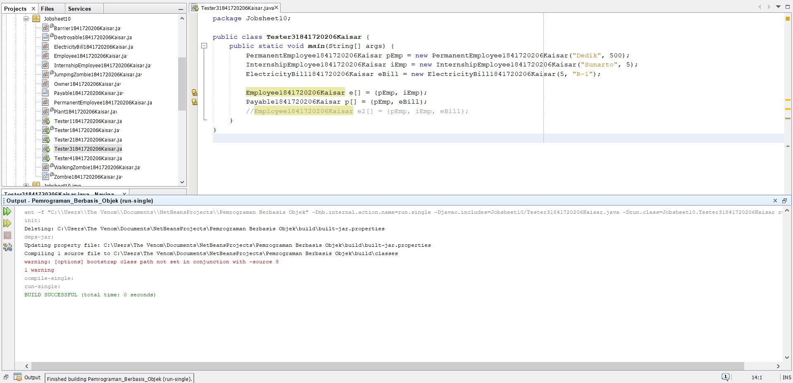

# Laporan Praktikum #10 - POLIMORFISME
## Kompetensi

Setelah melakukan percobaan pada jobsheet ini, diharapkan mahasiswa
mampu:
1. Memahami konsep dan bentuk dasar polimorfisme
2. Memahami konsep virtual method invication
3. Menerapkan polimorfisme pada pembuatan heterogeneous collection
4. Menerapkan polimorfisme pada parameter/argument method
5. Menerapkan object casting untuk meng-ubah bentuk objek

## Ringkasan Materi
Polimorfisme merupakan kemampuan suatu objek untuk memiliki banyak bentuk. Penggunaan polimorfisme yang paling umum dalam OOP terjadi ketika ada referensi super class yang digunakan untuk merujuk ke objek dari sub class. Dengan kata lain, ketika ada suatu objek yang dideklarasikan dari super class, maka objek tersebut bisa diinstansiasi sebagai objek dari sub class. Dari uraian tersebut bisa dilihat bahwa konsep polimorfisme bisa diterapkan pada class-class yang memiliki relasi inheritancE(relasi generalisasi atau IS-A).
 

## Percobaan

### Percobaan 1

Link kode program :

[Employee.java](../../src/10_Polimorfisme/Employee1841720206Kaisar.java)

[Payable.java](../../src/10_Polimorfisme/Payable1841720206Kaisar.java)

[InternshipEmployee.java](../../src/10_Polimorfisme/InternshipEmployee1841720206Kaisar.java)

[PermanentEmployee.java](../../src/10_Polimorfisme/PermanentEmployee1841720206Kaisar.java)

[ElectricityBill.java](../../src/10_Polimorfisme/ElectricityBill1841720206Kaisar.java)

[Tester1.java](../../src/10_Polimorfisme/Tester11841720206Kaisar.java)

### Pertanyaan

1. Class apa sajakah yang merupakan turunan dari class Employee?

Jawaban :

    InternshipEmployee dan permanentEmployee.

2. Class apa sajakah yang implements ke interface Payable?

Jawaban :

    PermanentEmployee dan ElectricityBill.

3. Perhatikan class Tester1, baris ke-10 dan 11. Mengapa e, bisa diisi
dengan objek pEmp (merupakan objek dari class
PermanentEmployee) dan objek iEmp (merupakan objek dari class
InternshipEmploye) ?

Jawaban :

    Karena keduanya sama – sama turunan dari class Employee.

4. Perhatikan class Tester1, baris ke-12 dan 13. Mengapa p, bisa diisi
dengan objek pEmp (merupakan objek dari class
PermanentEmployee) dan objek eBill (merupakan objek dari class
ElectricityBill) ?

Jawaban :

    Karena keduanya sama – sama mengimplementasikan interface Payable.

5. Coba tambahkan sintaks:
p = iEmp;
 e = eBill;
pada baris 14 dan 15 (baris terakhir dalam method main) ! Apa yang
menyebabkan error?

Jawaban :

    Karena iEmp tidak mengimplementasikan interface Payable dan eBill bukan merupakan turunan dari class Employee.

6. Ambil kesimpulan tentang konsep/bentuk dasar polimorfisme!

Jawaban :

    Polimorfisme dapat memiliki banyak bentuk, misalkan Employee, Employee dapat berbentuk InternshipEmployee maupun permanentEmployee

### Percobaan 2

Link kode program :

[Tester2.java](../../src/10_Polimorfisme/Tester21841720206Kaisar.java)

### Pertanyaan

1. Perhatikan class Tester2 di atas, mengapa pemanggilan
e.getEmployeeInfo() pada baris 8 dan
pEmp.getEmployeeInfo() pada baris 10 menghasilkan hasil
sama?

Jawaban :

    Karena  e dan pEmp sama – sama instan dari PermanentEmployee.

2. Mengapa pemanggilan method e.getEmployeeInfo() disebut
sebagai pemanggilan method virtual (virtual method invication),
sedangkan pEmp.getEmployeeInfo() tidak?

Jawaban :

    Karena pada e.getEmployeeInfo() terjadi overriding pada method getEmployeeInfo() di class Employee, sedangkan pEmp.getEmployeeInfo() tidak terjadi overriding karena yang dijalankan adalah langsung method getEmployeeInfo() di class PermanentEmployee.

3. Jadi apakah yang dimaksud dari virtual method invocation? Mengapa
disebut virtual?

Jawaban :

    Virtual method invocation terjadi ketika ada pemanggilan overriding method dari suatu objek polimorfisme. Disebut virtual karena antara method yang dikenali oleh compiler dan method yang dijalankan oleh JVM berbeda.

### Percobaan 3

Link kode program :

[Tester3.java](../../src/10_Polimorfisme/Tester31841720206Kaisar.java)

### Pertanyaan

1. Perhatikan array e pada baris ke-8, mengapa ia bisa diisi dengan
objek-objek dengan tipe yang berbeda, yaitu objek pEmp (objek dari
PermanentEmployee) dan objek iEmp (objek dari
InternshipEmployee) ?

Jawaban :

    Karena keduanya sama – sama turunan dari class Employee.

2. Perhatikan juga baris ke-9, mengapa array p juga biisi dengan objekobjek dengan tipe yang berbeda, yaitu objek pEmp (objek dari
PermanentEmployee) dan objek eBill (objek dari
ElectricityBilling) ?

Jawaban :

    Karena keduanya sama – sama mengimplementasikan interface Payable.

3. Perhatikan baris ke-10, mengapa terjadi error?

Jawaban :

    Karena eBill bukan merupakan turunan dari class Employee.

### Percobaan 4

Link kode program :

[Owner.java](../../src/10_Polimorfisme/Owner1841720206Kaisar.java)

[Tester4.java](../../src/10_Polimorfisme/Tester41841720206Kaisar.java)

### Pertanyaan

1. Perhatikan class Tester4 baris ke-7 dan baris ke-11, mengapa
pemanggilan ow.pay(eBill) dan ow.pay(pEmp) bisa dilakukan,
padahal jika diperhatikan method pay() yang ada di dalam class
Owner memiliki argument/parameter bertipe Payable? Jika
diperhatikan lebih detil eBill merupakan objek dari 
ElectricityBill dan pEmp merupakan objek dari
PermanentEmployee?

Jawaban :

    Karena keduanya mengimplementasikan interface Payable.

2. Jadi apakah tujuan membuat argument bertipe Payable pada
method pay() yang ada di dalam class Owner?

Jawaban :

    Untuk memanggil method getPaymentAmount yang ada pada masing – masing objek yang dimasukkan sebagai parameter (override method), serta mengcasting objek p menjadi objek sesungguhnya lalu memanggil suatu method yang hanya ada di class sesungguhnya.

3. Coba pada baris terakhir method main() yang ada di dalam class Tester4 ditambahkan perintah ow.pay(iEmp); Mengapa terjadi error?

Jawaban :

    Karena iEmp tidak mengimplementasi Payable.

4. Perhatikan class Owner, diperlukan untuk apakah sintaks p
instanceof ElectricityBill pada baris ke-6 ?

Jawaban :

    Untuk mengecek apakah objek yang dimasukkan sebagai parameter adalah sebuah instan dari class ElectricityBill.

5. Perhatikan kembali class Owner baris ke-7, untuk apakah casting
objek disana (ElectricityBill eb = (ElectricityBill) p)
diperlukan ? Mengapa objek p yang bertipe Payable harus di-casting
ke dalam objek eb yang bertipe ElectricityBill ?

Jawaban :

    Untuk dikembalikan ke Instan sesungguhnya sehingga dapat memanggil method getBillInfo() yang hanya ada di class ElectricityBill.

## Tugas

Link kode program :

[Barrier.java](../../src/10_Polimorfisme/Barrier1841720206Kaisar.java)

[Destroyable.java](../../src/10_Polimorfisme/Destroyable1841720206Kaisar.java)

[JumpingZombie.java](../../src/10_Polimorfisme/JumpingZombie1841720206Kaisar.java)

[Plant.java](../../src/10_Polimorfisme/Plant1841720206Kaisar.java)

[WalkingZombie.java](../../src/10_Polimorfisme/WalkingZombie1841720206Kaisar.java)

[Zombie.java](../../src/10_Polimorfisme/Zombie1841720206Kaisar.java)

[Tester.java](../../src/10_Polimorfisme/Tester1841720206Kaisar.java)

## Kesimpulan

Polimorfisme adalah kemampuan suatu objek untuk mengungkapkan banyak hal melalui satu cara yang sama. Polimorfisme mengizinkan kelas induk untuk mendefinisikan sebuah method general (bersifat umum) untuk semua kelas turunanya, dan selanjutnya kelas-kelas turunan dapat memperbaharui implementasi dari method tersebut secara lebih spesifik sesuai dengan karakteristiknya masing-masing.

## Pernyataan Diri

Saya menyatakan isi tugas, kode program, dan laporan praktikum ini dibuat oleh saya sendiri. Saya tidak melakukan plagiasi, kecurangan, menyalin/menggandakan milik orang lain.

Jika saya melakukan plagiasi, kecurangan, atau melanggar hak kekayaan intelektual, saya siap untuk mendapat sanksi atau hukuman sesuai peraturan perundang-undangan yang berlaku.

Ttd,

***(Kaisar Wahyu Arya)***