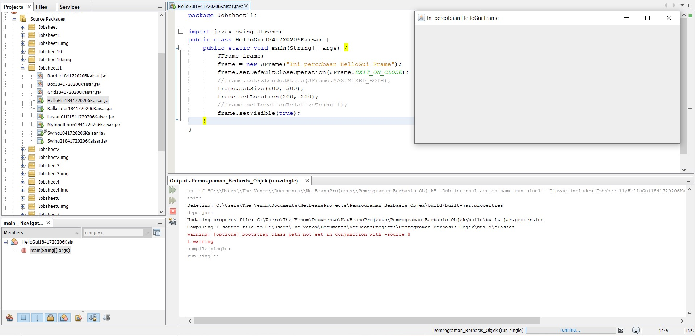
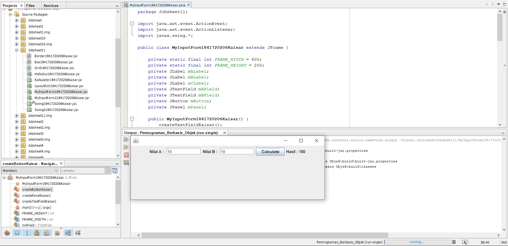
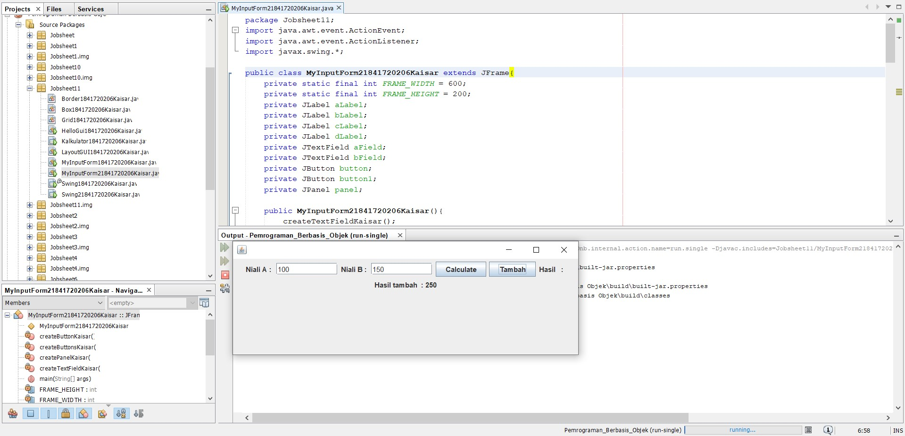
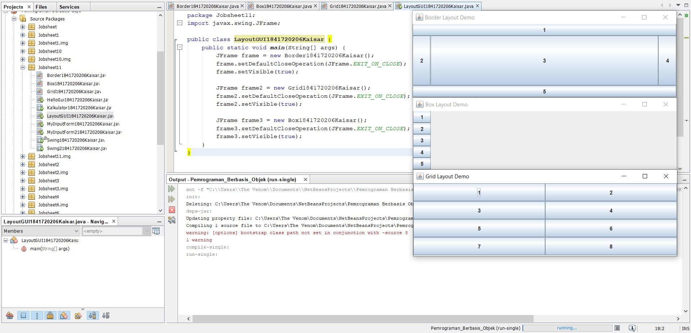
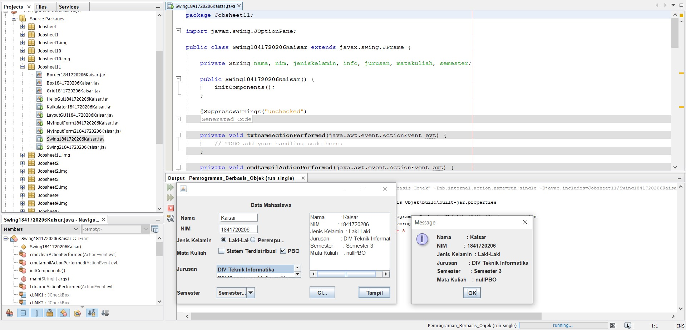
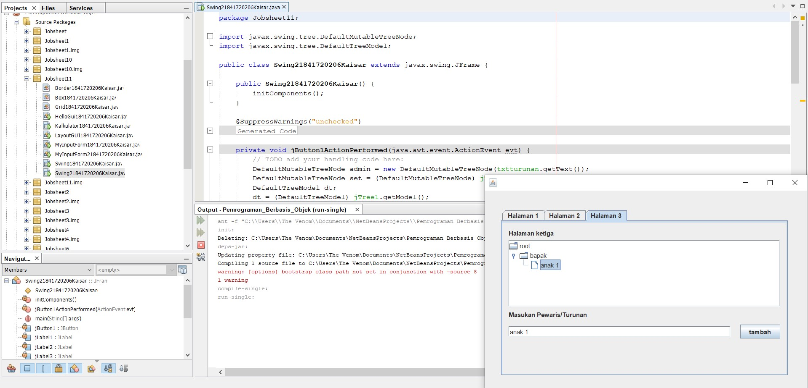
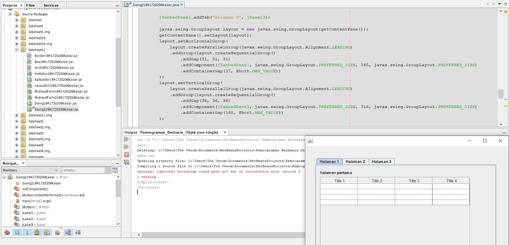
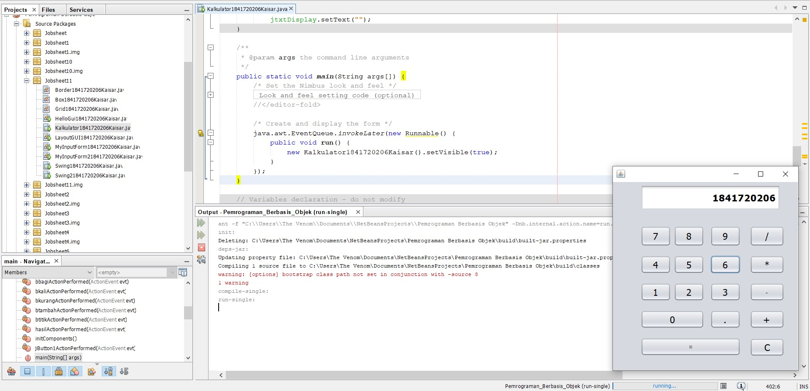

# Laporan Praktikum #11 - GUI (Graphical User Interface)  

## Kompetensi

Setelah menyelesaikan lembar kerja ini mahasiswa diharapkan mampu: 
1. Membuat aplikasi Graphical User Interface sederhana dengan bahasa pemrograman java; 
2. Mengenal komponen GUI seperti frame, label, textfield, combobox, radiobutton, checkbox, textarea, menu, serta table; 
3. Menambahkan event handling pada aplikasi GUI. 
 

## Ringkasan Materi
GUI 

Interaksi antara user dengan program hanya berbasis console editor dengan tampilan dos yang membosankan, maka agar interaksi antara user dengan program tidak membosankan diperlukanlah sebuah interface yang menghubungkan antara user dengan  program dengan tampilan grafis, interface ini dinamakan dengan GUI(Graphical User Interface). Dalam pemrograman GUI terdapat beberapa bagian yang harus dilakukan yaitu: 

1. Membuat windows utama  
2. Menentukan komponen-komponen pendukung    program  
3. Menentukan tata letak layout agar nantinya semua komponen–komponen yang sudah dipersiapkan bisa diaatur sedemikian rupa  
4. Event Handling dari sebuah aktivitas, seperti penekanan button, check box dan lain-lain
 
Java Swing merupakan bagian dari JFC (Java Foundation Classes) yang menyediakan API untuk menangani hal yang berkaitan dengan GUI bagi program Java.  Kita bisa membedakan komponen Swing dengan komponen AWT, di mana pada umumnya kelas-kelas yang berada dalam komponen Swing diawali dengan huruf J, misal: JButton, JLabel, JTextField, JRadioButton. 
 
 
 
## Percobaan

### Percobaan 1 JFrame HelloGUI

link kode program: 

[HelloGui.java](../../src/11_GUI/HelloGui1841720206Kaisar.java)

### Percobaan 2 Menangani Input Pada GUI

link kode program: 

[MyInputForm.java](../../src/11_GUI/MyInputForm1841720206Kaisar.java)

### Pertanyaan

1. Modifikasi kode program dengan menambahkan JButton baru untuk melakukan fungsi perhitungan penambahan, sehingga ketika button di klik (event click) maka akan menampilkan hasil penambahan dari nilai A dan B
  
Jawaban :

link kode program: 

[MyInputForm2.java](../../src/11_GUI/MyInputForm21841720206Kaisar.java)

### Percobaan 3 Manajemen Layout

link kode program: 

[LayoutGUI.java](../../src/11_GUI/LayoutGUI1841720206Kaisar.java)

[Border.java](../../src/11_GUI/Border1841720206Kaisar.java)

[Box.java](../../src/11_GUI/Box1841720206Kaisar.java)

[Grid.java](../../src/11_GUI/Grid1841720206Kaisar.java)

### Pertanyaan

1. Apa perbedaan dari Grid Layout, Box Layout dan Border Layout?

Jawaban :

    Perbedaan terdapat pada SetLayout yang digunakan dan tombolnya

2. Apakah fungsi dari masing-masing kode berikut? 

Jawaban :

    Fungsi masing-masing kode:

    1. Inisiasi object dari masing-masing layout pada object JFrame

    2. fungsi setDefaultCloseOperation(JFrame.EXIT_ON_CLOSE); adalah pada saat menekan tombol close maka akan keluar dari program

    3. fungsi frame.setVisible(true); adalah untuk menampilkan atau tidak layout yang sudah di buat sebelumnya

### Percobaan 4 Membuat GUI Melalui IDE Netbeans 

link kode program: 

[Swing.java](../../src/11_GUI/Swing1841720206Kaisar.java)

### Pertanyaan

1. Apakah fungsi dari kode berikut?

Jawaban :

    Fungsi dari kode program tersebut adalah untuk menjalankan fungsi scroll

2.  Mengapa pada bagian logika checkbox dan radio button digunakan multiple if ?

Jawaban :

    Multiple if digunakan untuk menampilkan pilihan saat dipilih karena kalau multiple if nya dihilangkan maka hasilnya akan null

3. Lakukan modifikasi pada program untuk melakukan menambahkan inputan berupa alamat dan berikan fungsi pemeriksaan pada nilai Alamat tersebut jika belum diisi dengan menampilkan pesan peringatan

### Percobaan 5 JTabPane, JTtree, JTable  

link kode program: 

[Swing2.java](../../src/11_GUI/Swing21841720206Kaisar.java)

### Pertanyaan

1. Apa kegunaan komponen swing JTabPane, JTtree, pada percobaan 5? 

Jawaban :

    Fungsi dari komponen swing JTabPane digunakan untuk merubah tampilan atau pindah tab dengan klik tab, sementara JTtree untuk menampung atau menampilkan hasil yang sudah ditambahkan

2. Modifikasi program untuk menambahkan komponen JTable pada tab Halaman 1 dan tab Halaman 2 

Jawaban :

## Tugas
Buatlah Sebuah Program yang mempunyai fungsi seperti kalkulator (mampu menjumlahkan, mengurangkan, mengalikan dan membagikan. Dengan tampilan seperti berikut. 

link kode program: 

[Kalkulator.java](../../src/11_GUI/Kalkulator1841720206Kaisar.java)

## Kesimpulan

GUI adalah jenis antarmuka pengguna yang menggunakan metode interaksi pada peranti elektronik secara grafis (bukan perintah teks) antara pengguna dan komputer.

## Pernyataan Diri

Saya menyatakan isi tugas, kode program, dan laporan praktikum ini dibuat oleh saya sendiri. Saya tidak melakukan plagiasi, kecurangan, menyalin/menggandakan milik orang lain.

Jika saya melakukan plagiasi, kecurangan, atau melanggar hak kekayaan intelektual, saya siap untuk mendapat sanksi atau hukuman sesuai peraturan perundang-undangan yang berlaku.

Ttd,

***(Kaisar Wahyu Arya)***
