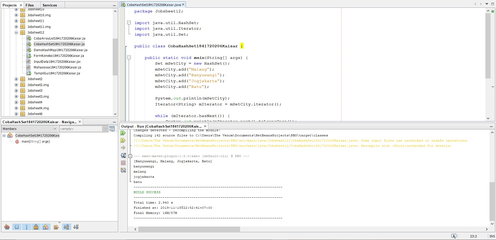
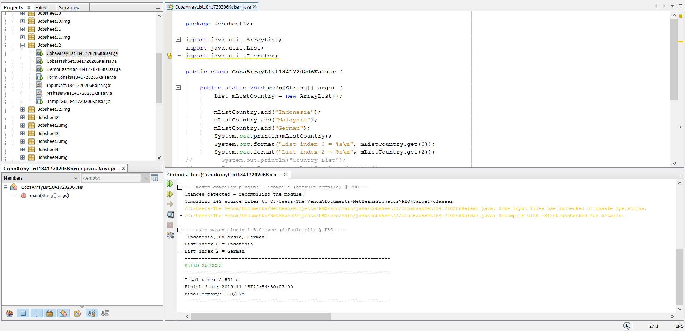
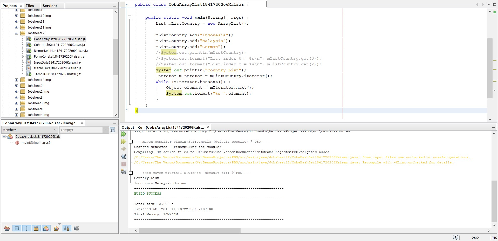
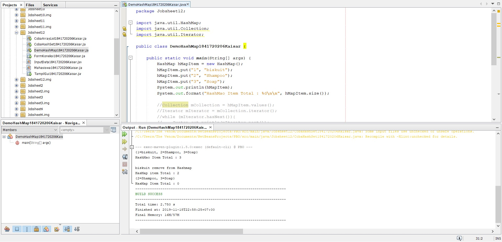
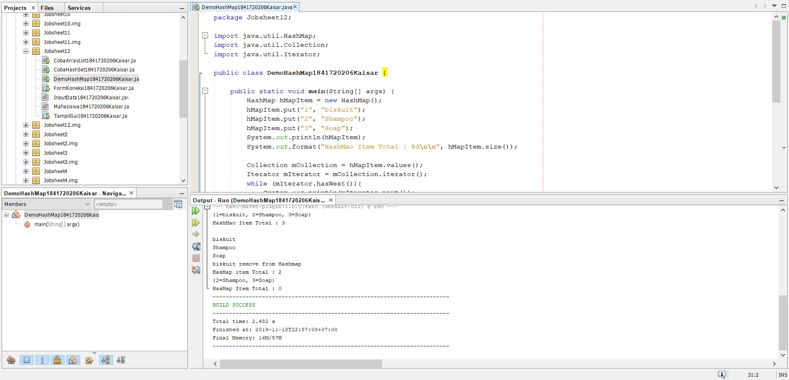
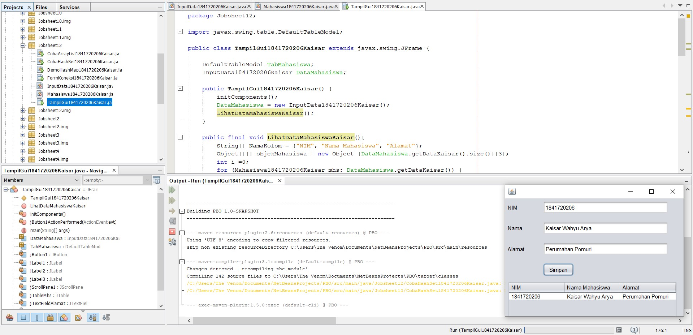
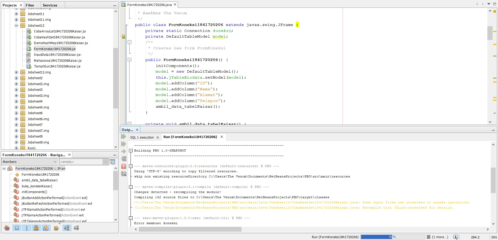
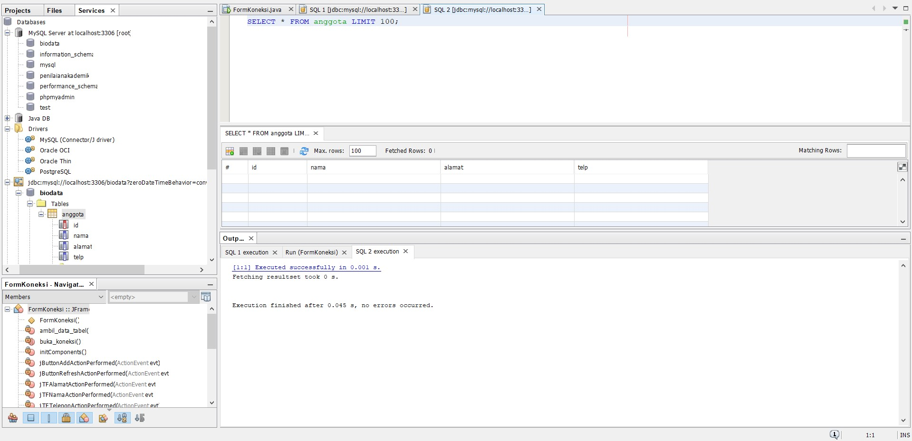

# Laporan Praktikum #12 - Collection (List, Set, Map) dan Database  

## Uji Kompetensi

1. Memahami cara penyimpanan objek menggunakan Collection dan Map.
2. Mengetahui pengelompokan dari Collection.
3. Mengetahui perbedaan dari interface Set, List dan Map.
4. Mengetahui penggunaan class-class dari interface Set, List, dan Map.
5. Memahami koneksi database menggunakan JDBC dan JDBC API
 

## Ringkasan Materi
Collection adalah suatu objek yang bisa digunakan untuk menyimpan sekumpulan objek. Objek yang ada dalam Collection disebut elemen. Collection menyimpan elemen yang bertipe Object, sehingga berbagai tipe object bisa disimpan dalam Collection. Class-class mengenai Collection tergabung dalam Java Collection Framework. Class-class Collection diletakkan dalam package java.util dan mempunyai dua interface utama yaitu Collection.

Collection terbagi menjadi 3 kelompok yaitu :

a. Set

Set mengikuti model himpunan, dimana objek/anggota yang tersimpan dalam Set harus unik. Urutan maupun letak dari anggota tidak penting, hanya keberadaan anggota saja yang penting. Kelas konkrit yang mengimplementasikan Set harus memastikan bahwa tidak terdapat elemen duplikat yang dapat ditambahkan ke dalam set. Yaitu, tidak terdapat dua elemen e1 dan e2 yang berada di dalam set yang membuat e1.equals(e2) bernilai true. Class yang mengimplementasikan interface Set adalah HashSet. 

b. List

List digunakan untuk menyimpan sekumpulan objek berdasarkan urutan masuk (ordered) dan menerima duplikat. Cara penyimpanannya seperti array, oleh sebab itu memiliki posisi awal dan posisi akhir, menyisipkan objek pada posisi tertentu, mengakses dan menghapus isi list, dimana semua proses ini selalu didasarkan pada urutannya. Class-class yang mengimplementasikan interface List adalah Vector, Stack, Linked List dan Array List.
 
c. Map

Perbedaaan mendasar map dengan collection yang lain, untuk menyimpan objek pada Map, perlu sepasang objek, yaitu key yang bersifat unik dan nilai yang disimpan. Untuk mengakses nilai tersebut maka kita perlu mengetahui key dari nilai tersebut. Map juga dikenal sebagai dictionary/kamus. Pada saat menggunakan kamus, perlu suatu kata yang digunakan untuk pencarian. Class-class yang mengimplementasikan Map adalah Hashtable,HashMap, LinkedHashMap. Pada jobsheet ini yang akan dibahas adalah HashMap.

d. JDBC API
JDBC API merupakan Java Database Connectivity Application Programming Interface ( JDBC API). Pada dasarnya JDBC API terdiri dari satu set kelas dan interface yang digunakan untuk berinteraksi dengan database dari aplikasi Java. Umumnya, JDBC API melakukan 3 (tiga) fungsi berikut :

- Membangun koneksi antara aplikasi Java dan database
- Membangun dan mengeksekusi query
- Memproses hasil 

## Percobaan

### Percobaan 1 : Set

link kode program: 

[CobaHashSet.java](../../src/12_Java_API/CobaHashSet1841720206Kaisar.java)

### Pertanyaan

1. Apakah fungsi import java.util.*; pada program diatas!

Jawaban :

    Import yang berfungsi untuk mengimport semua class dalam java

2. Pada baris program keberapakah yang berfungsi untuk menciptakan object HashSet?

Jawaban :

    Baris ke 10 yaitu :

    Set mSetCity = new HashSet();

3. Apakah fungsi potongan program dibawah ini pada percobaan 1!

Jawaban :

    Fungsi dari kode tersebut adalah untuk mengisi data dalam index array

4. Tambahkan set.add(“Malang”); kemudian jalankan program! Amati hasilnya dan jelaskan mengapa terjadi error!

Jawaban :

    Karena dalam pengisian data , tidak menggunakan objek “mSetCity”

5. Jelaskan fungsi potongan program dibawah ini pada percobaan 1!

Jawaban :

    Iterator digunakan untuk mengakses dan menampilkan nilai beserta tambahan method lain yang didefinisikan di dalam interface Iterator. Kode tersebut juga digunakan untuk menampilkan nilai dengan lower case 

### Percobaan 2 : List

link kode program: 

[CobaArrayList.java](../../src/12_Java_API/CobaArrayList1841720206Kaisar.java)

### Pertanyaan

1. Apakah fungsi potongan program dibawah ini!

Jawaban :

    Menampilkan data string yang sesuai dengan indeks array

2. Ganti potongan program pada soal no 1 menjadi sebagai berikut. Kemudian jalankan program tersebut!

link kode program: 

[CobaArrayList.java](../../src/12_Java_API/CobaArrayList1841720206Kaisar.java)

3. Jelaskan perbedaan menampilkan data pada ArrayList menggunakan potongan program pada soal no 1 dan no 2!

Jawaban :

    Pada soal no 1 pemanggilan data menggunakan inputan indeks array, sedangkan pada soal no 2 menggunakan iterasi, dimana jika ada data maka akan ditampilkan secara berurutan, jika tidak ada, maka proses iterasi berhenti 

### Percobaan 3 : Map

link kode program: 

[DemoHashMap.java](../../src/12_Java_API/DemoHashMap1841720206Kaisar.java)

### Pertanyaan

1. Jelaskan fungsi hMapItem.put("1","Biskuit") pada program!

Jawaban :

    Menambahkan isi map dengan pasangan kunci dan nilai. Kedua kunci dan nilai yang berupa sebuah objek. Jika map tidak memiliki kunci maka nilai yang di pilih akan diganti dengan yang baru. Con’t “A[kunci] = nilai” dalam array.

2. Jelaskan fungsi hMapItem.size() pada program!

Jawaban :

    Untuk menghitung jumlah hMapItem

3. Jelaskan fungsi hMapItem.remove("1") pada program!

Jawaban :

    Untuk menghapus kunci beserta nilai yang ditunjuknya, atau dengan kata lain menghapus pasangan kunci dan nilai pada map sekaligus. Per-element

4. Jelaskan fungsi hMapItem.clear() pada program!

Jawaban :

    Menghapus semua pasangan asosiasi dalam map

5. Tambahkan kode program yang di blok pada program yang sudah anda buat!

Jawaban :

    Collection mCollection = hMapItem.values();
    Iterator mIterator = mCollection.iterator();
        while (mIterator.hasNext()){
            System.out.println(mIterator.next());
        }

6. Jalankan program dan amati apa yang terjadi!

link kode program: 

[DemoHashMap.java](../../src/12_Java_API/DemoHashMap1841720206Kaisar.java)

7. Apakah perbedaan program sebelumnya dan setelah ditambahkan kode program pada soal no 5 diatas? Jelaskan!

Jawaban :

    Kode program diatas mIterator digunakan untuk menampilkan element pada collection. Yang mana mCollection tersebut mengambil value dari hMapItem

### Percobaan 4 : Implementasi ArrayList dalam GUI

link kode program: 

[Mahasiswa.java](../../src/12_Java_API/Mahasiswa1841720206Kaisar.java)

[InputData.java](../../src/12_Java_API/InputData1841720206Kaisar.java)

[TampilGui.java](../../src/12_Java_API/TampilGui1841720206Kaisar.java)

### Percobaan 5 : Aplikasi Biodata  

link kode program: 

[FormKoneksi.java](../../src/12_Java_API/FormKoneksi1841720206Kaisar.java)

## Kesimpulan

Collection adalah sebuah framework yang dibuat untuk menyimpan dan memanipulasi sebuah objek. Collection biasanya digunakan pada sebuah data seperti mencari, meng-urutkan, meng-input dan menghapus. Kerangka kerja (Framework) menyediakan dalam bentuk Interface (contoh : Set, List, Queue, Deque dll). untuk class (ArrayList, Vector, LingkedList, PriorityQueue, HashSet, LinkedHashSet, TreeSet dll).

## Pernyataan Diri

Saya menyatakan isi tugas, kode program, dan laporan praktikum ini dibuat oleh saya sendiri. Saya tidak melakukan plagiasi, kecurangan, menyalin/menggandakan milik orang lain.

Jika saya melakukan plagiasi, kecurangan, atau melanggar hak kekayaan intelektual, saya siap untuk mendapat sanksi atau hukuman sesuai peraturan perundang-undangan yang berlaku.

Ttd,

***(Kaisar Wahyu Arya)***