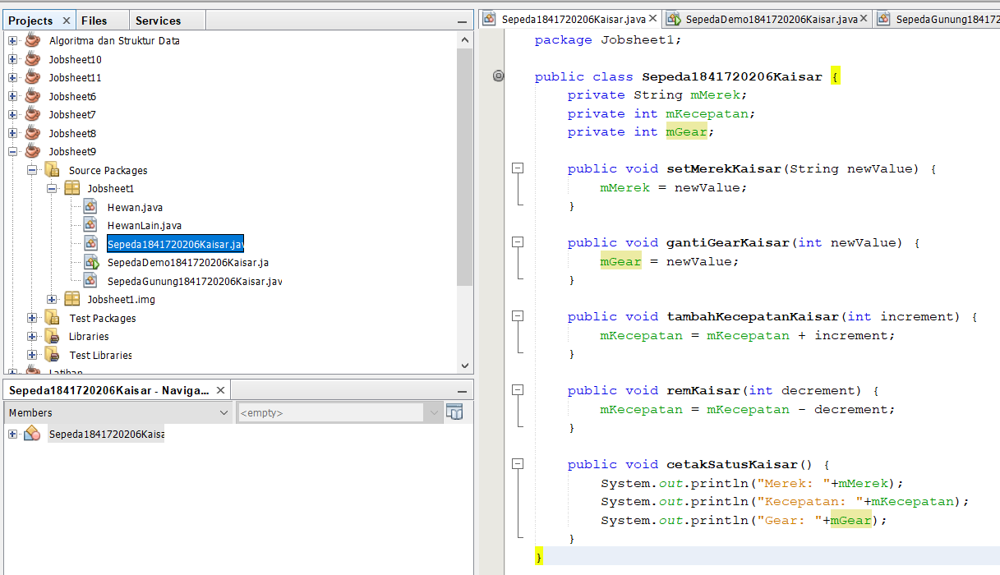
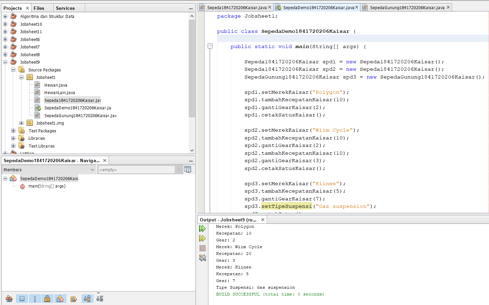
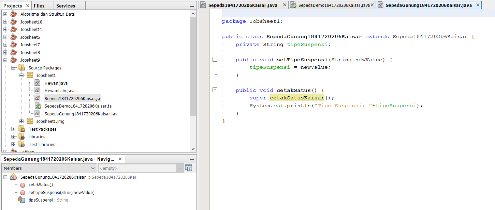
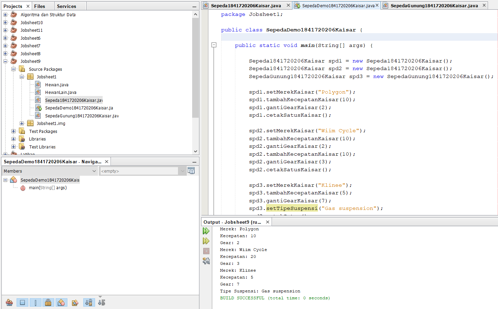
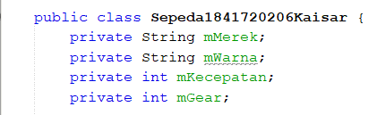
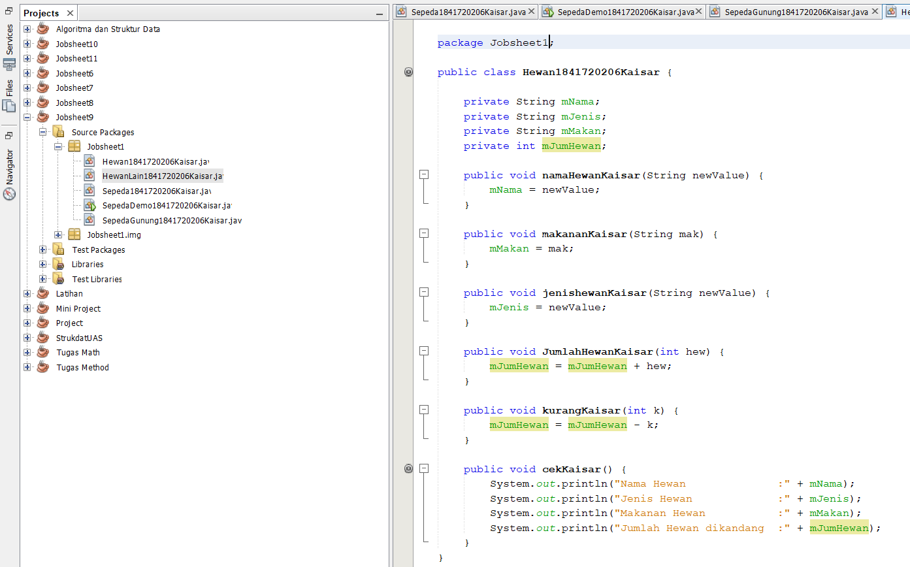

# Laporan Praktikum #1 - Pengantar Konsep PBO

## Kompetensi

1. Perbedaan paradigma berorientasi objek dengan paradigma struktural
2. Konsep dasar PBO 

## Ringkasan Materi

Sudah dapat memahami Konsep Dasar PBO

## Percobaan

### Percobaan 1

Didalam percobaan ini, kita akan mendemonstrasikan bagaimana membuat class, membuat object, kemudian mengakses method didalam class tersebut. 

Link kode program :
[Sepeda1841720206Kaisar.java](../../src/1_Pengantar_Konsep_PBO/Sepeda1841720206Kaisar.java)
[SepedaDemo1841720206Kaisar.java](../../src/1_Pengantar_Konsep_PBO/SepedaDemo1841720206Kaisar.java)

### Percobaan 2

Didalam percobaan ini, akan didemonstrasikan salah satu fitur yang paling penting dalam PBO, yaitu inheritance. Disini kita akan membuat class SepedaGunung yang mana adalah turunan/warisan dari class Sepeda. Pada dasarnya class SepedaGunung adalah sama dengan class Sepeda, hanya saja pada sepeda gunung terdapat tipe suspensi. Untuk itu kita tidak perlu membuat class Sepeda Gunung dari nol, tapi kita wariskan saja class Sepeda ke class SepedaGunung. 

Link kode program :
[SepedaGunung1841720206Kaisar.java](../../src/1_Pengantar_Konsep_PBO/SepedaGunung1841720206Kaisar.java)
[SepedaDemo1841720206Kaisar.java](../../src/1_Pengantar_Konsep_PBO/SepedaDemo1841720206Kaisar.java)

## Pertanyaan

1. Sebutkan dan jelaskan aspek-aspek yang ada pada pemrograman berorientasi objek! 
2. Apa yang dimaksud dengan object dan apa bedanya dengan class? 
3. Sebutkan salah satu kelebihan utama dari pemrograman berorientasi objek dibandingkan dengan pemrograman struktural! 
4. Pada class Sepeda, terdapat state/atribut apa saja? 
5. Tambahkan atribut warna pada class Sepeda. 
6. Mengapa pada saat kita membuat class SepedaGunung, kita tidak perlu membuat class nya dari nol? 

JAWABAN :

1. Object, Class, Enkapsulasi, Inheritance, dan Polimorfisme
2. Object adalah suatu rangkaian dalam program yang terdiri dari state dan behaviour. Sedangkan, Class adalah blueprint atau prototype dari objek.
3. Knosep OOP lebih efisien dibandingkan pemrograman terstruktur.
4. Merek, Kecepatan, Gear.
5. 
6. Karena SepedaGunung telah mewarisi class Sepeda (Inheritance).

## Tugas

(silakan kerjakan tugas di sini beserta `screenshot` hasil kompilasi program. Jika ada rujukan ke file program, bisa dibuat linknya di sini.)

Link kode program :
[Hewan1841720206Kaisar.java](../../src/1_Pengantar_Konsep_PBO/Hewan1841720206Kaisar.java)
[HewanLain1841720206Kaisar.java](../../src/1_Pengantar_Konsep_PBO/HewanLain1841720206Kaisar.java)

## Kesimpulan

Dari percobaan diatas, saya telah mendemonstrasikan bagaimana paradigma pemrograman berorientasi objek dan mengimplementasikannya kedalam program sederhana.

## Pernyataan Diri

Saya menyatakan isi tugas, kode program, dan laporan praktikum ini dibuat oleh saya sendiri. Saya tidak melakukan plagiasi, kecurangan, menyalin/menggandakan milik orang lain.

Jika saya melakukan plagiasi, kecurangan, atau melanggar hak kekayaan intelektual, saya siap untuk mendapat sanksi atau hukuman sesuai peraturan perundang-undangan yang berlaku.

Ttd,

Kaisar Wahyu Arya
