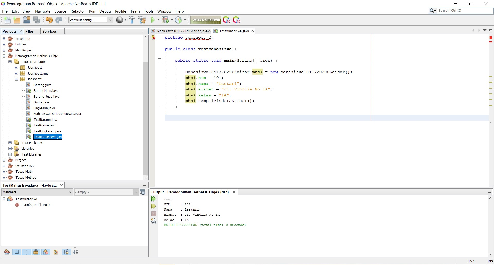

# Laporan Praktikum #2 - Class dan Object

## Kompetensi

 Mahasiswa dapat memahami deskripsi dari class dan object 
 Mahasiswa memahami implementasi dari class 
 Mahasiswa dapat memahami implementasi dari attribute 
 Mahasiswa dapat memahami implementasi dari method 
 Mahasiswa dapat memahami implementasi dari proses instansiasi 
 Mahasiswa dapat memahami implementasi dari try-catch 
 Mahasiswa dapat memahami proses pemodelan class diagram menggunakan UML 

## Ringkasan Materi

Saya sudah dapat memahami setiap implementasi pada Jobsheet yang diberikan

## Percobaan

### Percobaan 1

(berisi penjelasan percobaan 1. Jika ada rujukan ke file program, bisa dibuat linknya di sini.)

`contoh screenshot yang benar, menampilkan 3 komponen, yaitu struktur project, kode program, dan hasil kompilasi`

Contoh link kode program : [ini contoh link ke kode program](../../src/1_Pengantar_Konsep_PBO/Contoh12345Habibie.java)

### Percobaan 2

 Membuat dan mengakses anggota suatu class

Contoh link kode program :
[Mahasiswa1841720206Kaisar.java](../../src/2_Class_dan_Object/Mahasiswa1841720206Kaisar.java)
[TestMahasiswa1841720206Kaisar.java](../../src/2_Class_dan_Object/TestMahasiswa1841720206Kaisar.java)

## Pertanyaan

(silakan ketik pertanyaan di sini beserta jawabannya.)

## Tugas

(silakan kerjakan tugas di sini beserta `screenshot` hasil kompilasi program. Jika ada rujukan ke file program, bisa dibuat linknya di sini.)

`contoh screenshot yang benar, menampilkan 3 komponen, yaitu struktur project, kode program, dan hasil kompilasi`

Contoh link kode program : [ini contoh link ke kode program](../../src/1_Pengantar_Konsep_PBO/Contoh12345Habibie.java)

## Kesimpulan

(Berisi simpulan yang telah diperoleh selama praktikum atau belajar pada pertemuan ini)

## Pernyataan Diri

Saya menyatakan isi tugas, kode program, dan laporan praktikum ini dibuat oleh saya sendiri. Saya tidak melakukan plagiasi, kecurangan, menyalin/menggandakan milik orang lain.

Jika saya melakukan plagiasi, kecurangan, atau melanggar hak kekayaan intelektual, saya siap untuk mendapat sanksi atau hukuman sesuai peraturan perundang-undangan yang berlaku.

Ttd,

***(silakan isi nama lengkap di sini)***
