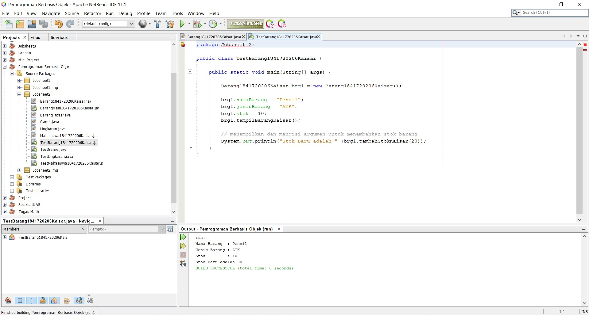

# Laporan Praktikum #2 - Class dan Object

## Kompetensi

 Mahasiswa dapat memahami deskripsi dari class dan object 
 Mahasiswa memahami implementasi dari class 
 Mahasiswa dapat memahami implementasi dari attribute 
 Mahasiswa dapat memahami implementasi dari method 
 Mahasiswa dapat memahami implementasi dari proses instansiasi 
 Mahasiswa dapat memahami implementasi dari try-catch 
 Mahasiswa dapat memahami proses pemodelan class diagram menggunakan UML 

## Ringkasan Materi

Saya sudah dapat memahami setiap implementasi pada Jobsheet yang diberikan

## Percobaan

### Percobaan 1

(berisi penjelasan percobaan 1. Jika ada rujukan ke file program, bisa dibuat linknya di sini.)

`contoh screenshot yang benar, menampilkan 3 komponen, yaitu struktur project, kode program, dan hasil kompilasi`

Contoh link kode program : [ini contoh link ke kode program](../../src/1_Pengantar_Konsep_PBO/Contoh12345Habibie.java)

### Percobaan 2

 Membuat dan mengakses anggota suatu class

Contoh link kode program :
[Mahasiswa1841720206Kaisar.java](../../src/2_Class_dan_Object/Mahasiswa1841720206Kaisar.java)
[TestMahasiswa1841720206Kaisar.java](../../src/2_Class_dan_Object/TestMahasiswa1841720206Kaisar.java)

Jelaskan pada bagian mana proses pendeklarasian atribut pada program diatas!
- Semua Atribut dideklarasikan dengan public pada class Mahasiswa

Jelaskan pada bagian mana proses pendeklarasian method pada program diatas!
- Semua method dideklarasikan pada class Mahasiswa

Berapa banyak objek yang di instansiasi pada program diatas!
- 1 (satu)

 Apakah yang sebenarnya dilakukan pada sintaks program “mhs1.nim=101” ?
- Memasukkan atribut nim pada mhs1 dengan nilai 101

 Apakah yang sebenarnya dilakukan pada sintaks program “mhs1.tampilBiodata()” ?
- Memanggil method tampilBiodata pada mhs1

Instansiasi 2 objek lagi pada program diatas!
- Syntax :

        Mahasiswa1841720206Kaisar mhs2 = new Mahasiswa1841720206Kaisar();
        mhs2.nim = 102;
        mhs2.nama = "Citra";
        mhs2.alamat = "Jl. Vinolia No 2A";
        mhs2.kelas = "1A";
        mhs2.tampilBiodataKaisar();
        
        Mahasiswa1841720206Kaisar mhs3 = new Mahasiswa1841720206Kaisar();
        mhs3.nim = 102;
        mhs3.nama = "Bunga";
        mhs3.alamat = "Jl. Vinolia No 3A";
        mhs3.kelas = "1A";
        mhs3.tampilBiodataKaisar();

### Percobaan 3

Menulis method yang memiliki argument/parameter dan memiliki return

Contoh link kode program :
[Barang1841720206Kaisar.java](../../src/2_Class_dan_Object/Barang1841720206Kaisar.java)
[TestBarang1841720206Kaisar.java](../../src/2_Class_dan_Object/TestBarang1841720206Kaisar.java)

 Apakah fungsi argumen dalam suatu method
 - Untuk menambahkan data dari luar method
 Ambil kesimpulan tentang kegunaan dari kata kunci return , dan kapan suatu method harus memiliki return!
 - return berfungsi untuk mengembalikkan nilai akhir dari suatu method return dapat digunakan hanya pada method yang memiliki nilai misalnya meethod bertipe integer

## Tugas

(silakan kerjakan tugas di sini beserta `screenshot` hasil kompilasi program. Jika ada rujukan ke file program, bisa dibuat linknya di sini.)

`contoh screenshot yang benar, menampilkan 3 komponen, yaitu struktur project, kode program, dan hasil kompilasi`

Contoh link kode program : [ini contoh link ke kode program](../../src/1_Pengantar_Konsep_PBO/Contoh12345Habibie.java)

## Kesimpulan

(Berisi simpulan yang telah diperoleh selama praktikum atau belajar pada pertemuan ini)

## Pernyataan Diri

Saya menyatakan isi tugas, kode program, dan laporan praktikum ini dibuat oleh saya sendiri. Saya tidak melakukan plagiasi, kecurangan, menyalin/menggandakan milik orang lain.

Jika saya melakukan plagiasi, kecurangan, atau melanggar hak kekayaan intelektual, saya siap untuk mendapat sanksi atau hukuman sesuai peraturan perundang-undangan yang berlaku.

Ttd,

Kaisar Wahyu Arya
