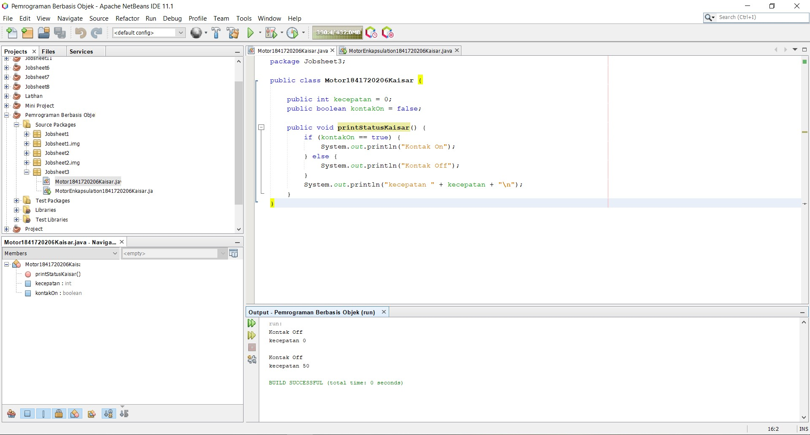
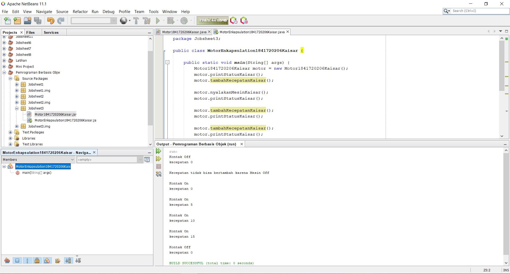
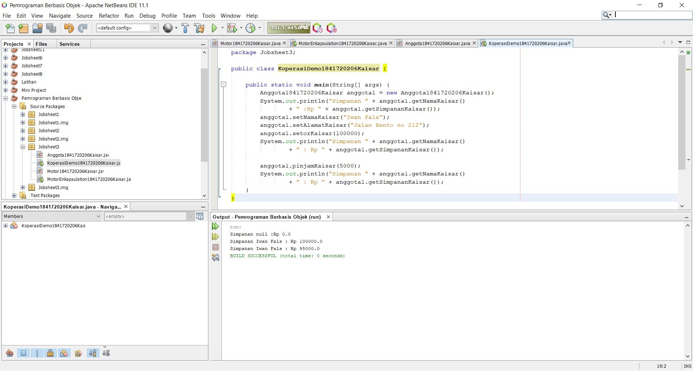
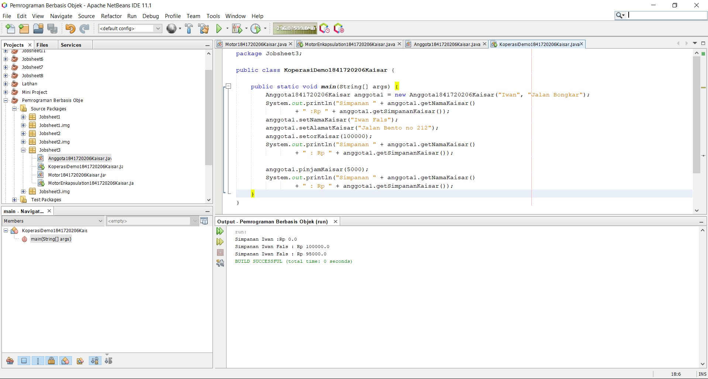
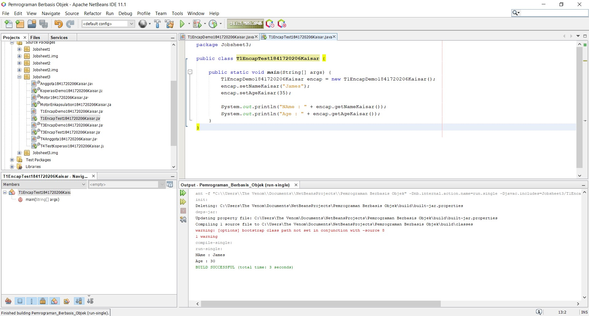
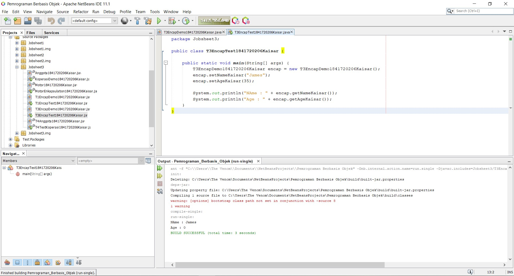
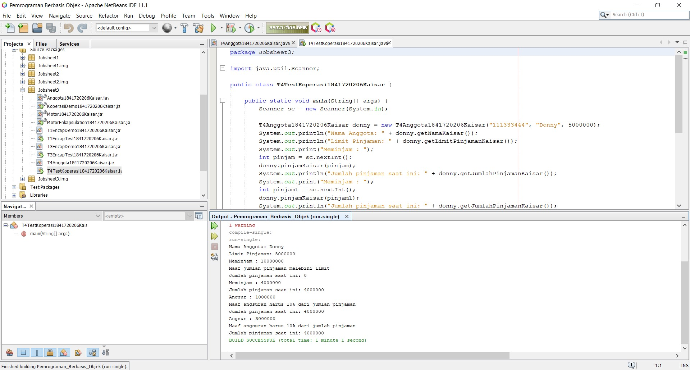

# Laporan Praktikum #3 - Enkapsulasi

## Kompetensi

Setelah melakukan percobaan pada modul ini, mahasiswa memahami konsep:
1. Konstruktor
2. Akses Modifier
3. Atribut/method pada class
4. Intansiasi atribut/method
5. Setter dan getter
6. Memahami notasi pada UML Class Diagram

## Ringkasan Materi

Enkapsukasi disebut juga dengan information-hiding yaitu menyembunyikan detail
proses suatu objek dari pengguna.

## Percobaan

### Percobaan 1

Didalam percobaan enkapsulasi, buatlah class Motor yang memiliki atribut kecepatan dan kontakOn,
dan memiliki method printStatus() untuk menampilkan status motor.

Link kode program :

[Motor1841720206Kaisar.java](../../src/3_Enkapsulasi/Motor1841720206Kaisar.java)

[MotorEnkapsulasi1841720206Kaisar.java](../../src/3_Enkapsulasi/MotorEnkapsulasi1841720206Kaisar.java)

### Percobaan 2

Pada percobaan ini akan digunakan access modifier untuk memperbaiki cara kerja class Motor pada
percobaan ke-1.

Link kode program :

[Motor1841720206Kaisar.java](../../src/3_Enkapsulasi/Motor1841720206Kaisar.java)

[MotorEnkapsulasi1841720206Kaisar.java](../../src/3_Enkapsulasi/MotorEnkapsulasi1841720206Kaisar.java)

### Percobaan 3

Misalkan di sebuah sistem informasi koperasi, terdapat class Anggota. Anggota memiliki atribut
nama, alamat dan simpanan, dan method setter, getter dan setor dan pinjam. Semua atribut pada
anggota tidak boleh diubah sembarangan, melainkan hanya dapat diubah melalui method setter,
getter, setor dan tarik. Khusus untuk atribut simpanan tidak terdapat setter karena simpanan akan
bertambah ketika melakukan transaksi setor dan akan berkurang ketika melakukan
peminjaman/tarik.

Link kode program :

[Anggota1841720206Kaisar.java](../../src/3_Enkapsulasi/Anggota1841720206Kaisar.java)

[KoperasiDemo1841720206Kaisar.java](../../src/3_Enkapsulasi/KoperasiDemo1841720206Kaisar.java)

### Percobaan 4

Konstruktor, Instansiasi dari percobaan 3

Link kode program :

[Anggota1841720206Kaisar.java](../../src/3_Enkapsulasi/Anggota1841720206Kaisar.java)

[KoperasiDemo1841720206Kaisar.java](../../src/3_Enkapsulasi/KoperasiDemo1841720206Kaisar.java)

## Tugas

### Tugas 1

Link kode program :

[T1EncapDemo1841720206Kaisar.java](../../src/3_Enkapsulasi/T1EncapDemo1841720206Kaisar.java)

[T1EncapTest1841720206Kaisar.java](../../src/3_Enkapsulasi/T1EncapTest1841720206Kaisar.java)

### Tugas 2

Pada program diatas, pada class EncapTest kita mengeset age dengan nilai 35, namun pada
saat ditampilkan ke layar nilainya 30, jelaskan mengapa.

Jawab :

Karena di kelas EncapDemo dalam method setAge “if(newAge > 30)” menandakan
bahwa tidak bisa melebihi angka 30, Karena nilai 30 adalah angka maksimal.
Melainkan jika memasukkan nilai kurang dari 30 maka hasilnya akan sesuai dengan
yang di inputkan.

### Tugas 3

Ubah program diatas agar atribut age dapat diberi nilai maksimal 30 dan minimal 18.

Hasil output : 0 karena age lebih dari 30

Link kode program :

[T3EncapDemo1841720206Kaisar.java](../../src/3_Enkapsulasi/T3EncapDemo1841720206Kaisar.java)

[T3EncapTest1841720206Kaisar.java](../../src/3_Enkapsulasi/T3EncapTest1841720206Kaisar.java)

### Tugas 4

. Pada sebuah sistem informasi koperasi simpan pinjam, terdapat class Anggota yang memiliki
atribut antara lain nomor KTP, nama, limit peminjaman, dan jumlah pinjaman. Anggota
dapat meminjam uang dengan batas limit peminjaman yang ditentukan. Anggota juga dapat
mengangsur pinjaman. Ketika Anggota tersebut mengangsur pinjaman, maka jumlah
pinjaman akan berkurang sesuai dengan nominal yang diangsur. Buatlah class Anggota
tersebut, berikan atribut, method dan konstruktor sesuai dengan kebutuhan. Uji dengan
TestKoperasi berikut ini untuk memeriksa apakah class Anggota yang anda buat telah sesuai
dengan yang diharapkan.

Link kode program :

[T4Anggota1841720206Kaisar.java](../../src/3_Enkapsulasi/T4Anggota1841720206Kaisar.java)

[T4TestKoperasi1841720206Kaisar.java](../../src/3_Enkapsulasi/T4TestKoperasi1841720206Kaisar.java)

## Kesimpulan

Dari percobaan diatas, telah dipelajari kosep dari enkapsulasi, kontruktor, access modifier yang
terdiri dari 4 jenis yaitu public, protected, default dan private. Konsep atribut atau method class
yang ada di dalam blok code class dan konsep instansiasi atribut atau method. Cara penggunaan
getter dan setter beserta fungsi dari getter dan setter. Dan juga telah dipelajari atau memahami
notasi UML

## Pernyataan Diri

Saya menyatakan isi tugas, kode program, dan laporan praktikum ini dibuat oleh saya sendiri. Saya tidak melakukan plagiasi, kecurangan, menyalin/menggandakan milik orang lain.

Jika saya melakukan plagiasi, kecurangan, atau melanggar hak kekayaan intelektual, saya siap untuk mendapat sanksi atau hukuman sesuai peraturan perundang-undangan yang berlaku.

Ttd,

Kaisar Wahyu Arya
