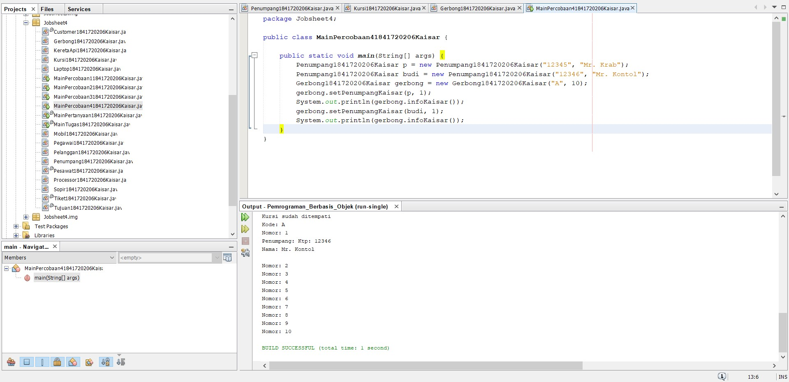

# Laporan Praktikum #4 - Relasi Class

## Kompetensi

Setelah menempuh pokok bahasan ini, mahasiswa mampu :
1. Memahami konsep relasi kelas;
2. Mengimplementasikan relasi has‑a dalam program.

## Ringkasan Materi

Hubungan antar-kelas pada Java ada empat termasuk sifat pewarisan kelas, yaitu Asosiasi, Agregasi, Komposisi dan Pewarisan.

## Percobaan

### Percobaan 1

Membuat class Processor, Laptop, dan MainPercobaan1

Link kode program :

[Processor.java](../../src/4_Relasi_Class/Processor1841720206Kaisar.java)

[Laptop.java](../../src/4_Relasi_Class/Laptop1841720206Kaisar.java)

[MainPercobaan1.java](../../src/4_Relasi_Class/MainPercobaan11841720206Kaisar.java)

## Pertanyaan

Berdasarkan percobaan 1, jawablah pertanyaan‑pertanyaan yang terkait:

1. Di dalam class Processor dan class Laptop , terdapat method setter dan getter untuk masing‑masing atributnya. Apakah gunanya method setter dan getter tersebut ?

Jawaban :

- Setter berfungsi untuk mengisi data ke dalam atribut. Sedangkan Getter memiliki nilai kembalian sesuai dengan tipe data yang akan diambil.

2. Di dalam class Processor dan class Laptop, masing‑masing terdapat konstruktor default dan konstruktor berparameter. Bagaimanakah beda penggunaan dari kedua jenis konstruktor tersebut ?

Jawaban :

- Konstruktor default digunakan untuk inisialisasi objek secara otomatis. Sedangkan yang berparameter digunakan untuk inisialisasi data untuk class.

3. Perhatikan class Laptop, di antara 2 atribut yang dimiliki (merk dan proc), atribut manakah yang bertipe object ?

Jawaban :

- proc (Processor).

4. Perhatikan class Laptop, pada baris manakah yang menunjukan bahwa class Laptop memiliki relasi dengan class Processor ?

Jawaban :

- Padda baris : this.proc = proc;

5. Perhatikan pada class Laptop , Apakah guna dari sintaks proc.info() ?

Jawaban :

- Untuk menampilkan informasi data dari objek processor.

6. Pada class MainPercobaan1, terdapat baris kode: Laptop l = new Laptop("Thinkpad", p);. Apakah p tersebut ? Dan apakah yang terjadi jika baris kode tersebut diubah menjadi: Laptop l = new Laptop("Thinkpad", new Processor("Intel i5", 3)); Bagaimanakah hasil program saat dijalankan, apakah ada perubahan ? 

Jawaban :

- p adalah instansiasi dari objek Processor. Hasil output tidak ada perubahan

### Percobaan 2

Buatlah program rental mobil dimana Pelanggan bisa menyewa mobil sekaligus sopir. Biaya sopir dan biaya sewa mobil dihitung per hari. 

Link kode program :

[Mobil.java](../../src/4_Relasi_Class/Mobil1841720206Kaisar.java)

[Sopir.java](../../src/4_Relasi_Class/Sopir1841720206Kaisar.java)

[Pelanggan.java](../../src/4_Relasi_Class/Pelanggan1841720206Kaisar.java)

[MainPercobaan2.java](../../src/4_Relasi_Class/MainPercobaan21841720206Kaisar.java)

## Pertanyaan

1. Perhatikan class Pelanggan. Pada baris program manakah yang menunjukan bahwa class Pelanggan memiliki relasi dengan class Mobil dan class Sopir ?

Jawaban :

- Pada saat pendeklarasian atribut :

    private Mobil mobil;
    private Sopir sopir;

2. Perhatikan method hitungBiayaSopir pada class Sopir, serta method hitungBiayaMobil pada class Mobil. Mengapa menurut Anda method tersebut harus memiliki argument hari ?

Jawaban :

Untuk menghitung biaya mobil berdasarkan hari.

3. Perhatikan kode dari class Pelanggan. Untuk apakah perintah mobil.hitungBiayaMobil(hari) dan sopir.hitungBiayaSopir(hari) ?

Jawaban :

- Untuk menghitung total biaya sopir dan mobil yang mana nanti akan di total secra keseluruhan.

4. Perhatikan class MainPercobaan2. Untuk apakah sintaks p.setMobil(m) dan p.setSopir(s) ?

Jawaban :

- Untuk mengisi data mobil dan sopir.

5. Perhatikan class MainPercobaan2. Untuk apakah proses p.hitungBiayaTotal() tersebut ?

Jawaban :

- Untuk menghitung total biaya sopir dan mobil.

6. Perhatikan class MainPercobaan2, coba tambahkan pada baris terakhir dari method main dan amati perubahan saat di‑run! 
 
System.out.println(p.getMobil().getMerk()); 
 
Jadi untuk apakah sintaks p.getMobil().getMerk() yang ada di dalam method main tersebut? 

Jawaban :

- Untuk mengambil nilai merek dari mobil

### Percobaan 3

 Membuat relasi class yang melibatkan lebih dari satu (Multiciply).
 
 

Link kode program :

[Pegawai.java](../../src/4_Relasi_Class/Pegawai1841720206Kaisar.java)

[KeretaApi.java](../../src/4_Relasi_Class/KeretaApi1841720206Kaisar.java)

[MainPercobaan3.java](../../src/4_Relasi_Class/MainPercobaan31841720206Kaisar.java)

## Pertanyaan

1. Di dalam method info() pada class KeretaApi, baris this.masinis.info() dan this.asisten.info() digunakan untuk apa ?

Jawaban :

- Untuk menampilkan info dari asisten dan masisnis.

2. Buatlah main program baru dengan nama class MainPertanyaan pada package yang sama. Tambahkan kode berikut pada method main() !
 
Pegawai masinis = new Pegawai("1234", "Spongebob Squarepants"); KeretaApi keretaApi = new KeretaApi("Gaya Baru", "Bisnis", masinis); 
 
System.out.println(keretaApi.info());

Link kode program :

[MainPertanyaan.java](../../src/4_Relasi_Class/MainPertanyaan1841720206Kaisar.java)
 
3. Apa hasil output dari main program tersebut ? Mengapa hal tersebut dapat terjadi ?

- Error, karena pada System.out.println(keretaApi.info()); terdapat method info untuk menampilkan data dari kereta Api dimana membutuhkan nama, kelas, masisnis, dan asisten. Sedangkan pada class MainPertanyaan asisten belum di instansiasi.

4. Perbaiki class KeretaApi sehingga program dapat berjalan !

Perbaikannya memiliki sintaks yang sama dengan :

[MainPercobaan3.java](../../src/4_Relasi_Class/MainPercobaan31841720206Kaisar.java)

### Percobaan 4

 Membuat class Kursi, Penumpang, Gerbong, dan Main.
 
 

Link kode program :

[Penumpang.java](../../src/4_Relasi_Class/Penumpang1841720206Kaisar.java)

[Kursi.java](../../src/4_Relasi_Class/Kursi1841720206Kaisar.java)

[Gerbong.java](../../src/4_Relasi_Class/Gerbong1841720206Kaisar.java)

[MainPercobaan4.java](../../src/4_Relasi_Class/MainPercobaan41841720206Kaisar.java)

## Pertanyaan

1. Pada main program dalam class MainPercobaan4, berapakah jumlah kursi dalam Gerbong A ?

Jawaban :

- 10 (Sepuluh).

2. Perhatikan potongan kode pada method info() dalam class Kursi. Apa maksud kode tersebut ? 
 
... if (this.penumpang != null) { info += "Penumpang: " + penumpang.info() + "\n"; } ... 

Jawaban :

- Jika penumpang sudah terisi maka akan menampilkan info dari penumpang tersebut.
 
3. Mengapa pada method setPenumpang() dalam class Gerbong, nilai nomor dikurangi dengan angka 1 ?

Jawaban :

- Untuk mengurangi indeks penumpang saat dieksekusi.

4. Instansiasi objek baru budi dengan tipe Penumpang, kemudian masukkan objek baru tersebut pada gerbong dengan gerbong.setPenumpang(budi, 1). Apakah yang terjadi ?

Jawaban :

- Output yang keluar menggantikan objek p yang sebelumnya karena memiliki nomor kursi yang sama.

5. Modifikasi program sehingga tidak diperkenankan untuk menduduki kursi yang sudah ada penumpang lain !

Jawaban :

- 

## Tugas

 Membuat class Pesawat, Tiket, Tujuan, Customer, dan Main.
 
 

Link kode program :

[Pesawat.java](../../src/4_Relasi_Class/Pesawat1841720206Kaisar.java)

[Tiket.java](../../src/4_Relasi_Class/Tiket1841720206Kaisar.java)

[Tujuan.java](../../src/4_Relasi_Class/Tujuan1841720206Kaisar.java)

[Customer.java](../../src/4_Relasi_Class/Customer1841720206Kaisar.java)

[MainTugas.java](../../src/4_Relasi_Class/MainTugas1841720206Kaisar.java)

## Kesimpulan

Dari percobaan diatas, telah dipelajari bahwa class dapat saling berelasi.

## Pernyataan Diri

Saya menyatakan isi tugas, kode program, dan laporan praktikum ini dibuat oleh saya sendiri. Saya tidak melakukan plagiasi, kecurangan, menyalin/menggandakan milik orang lain.

Jika saya melakukan plagiasi, kecurangan, atau melanggar hak kekayaan intelektual, saya siap untuk mendapat sanksi atau hukuman sesuai peraturan perundang-undangan yang berlaku.

Ttd,

Kaisar Wahyu Arya
