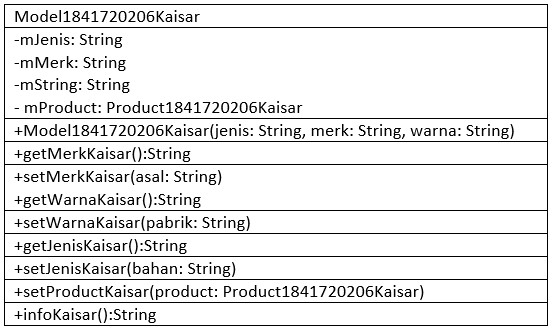

# Kuis 1 - PBO - 2019

Kuis 1
Pemrograman Berbasis Objek 2019
25 Sept 2019

# Data Diri
* NIM   : 1841720206
* Nama  : Kaisar Wahyu Arya
* Kelas : TI-2C

# Soal
## Soal 1

## Soal 2

Link kode program :

[Product.java](../../src/5_Kuis_I/Product1841720206Kaisar.java)

[Model.java](../../src/5_Kuis_I/Model1841720206Kaisar.java)

[Bayar.java](../../src/5_Kuis_I/Bayar1841720206Kaisar.java)

[Main.java](../../src/5_Kuis_I/Main1841720206Kaisar.java)

# Pernyataan Diri
Saya menyatakan jawaban pada Kuis 1 ini dibuat oleh saya sendiri. Saya tidak melakukan plagiasi, kecurangan, menyalin/menggandakan milik orang lain.

Jika saya melakukan plagiasi, kecurangan, atau melanggar hak kekayaan inteklektual, saya siap untuk mendapat sanksi atau hukuman sesuai peraturan perundang-undangan yang berlaku

Ttd,

**Kaisar Wahyu Arya**