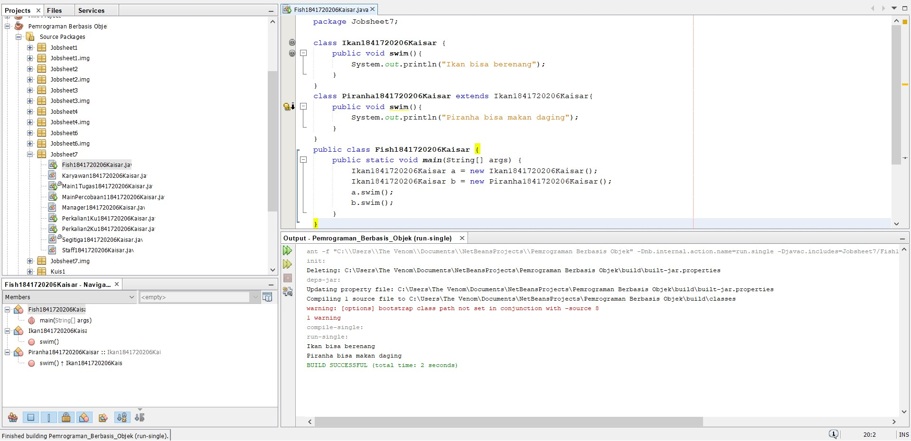

# Laporan Praktikum #6 - INHERITANCE(PEWARISAN)

## Kompetensi

Setelah menempuh pokok bahasan ini, mahasiswa mampu :
1. Memahami konsep overloading dan overriding,
2. Memahami perbedaan overloading dan overriding,
3. Ketepatan dalam mengidentifikasi method overriding dan overloading
4. Ketepatan dalam mempraktekkan instruksi pada jobsheet
5. Mengimplementasikan method overloading dan overriding.

## Ringkasan Materi
Overloading adalah menuliskan kembali method dengan nama yang sama pada suatu class. Tujuannya dapat memudahkan penggunaan/pemanggilan method dengan fungsionalitas yang mirip.

Overriding adalah Sublass yang berusaha memodifkasi tingkah laku yang diwarisi dari superclass. Tujuannya subclass dapat memiliki tingkah laku yang lebih spesifik sehingga dapat dilakukan dengan cara mendeklarasikan kembali method milik parent class di subclass.
 

## Percobaan

### Percobaan 1

Link kode program :

[Karyawan.java](../../src/7_Overriding_dan_Overloading/Karyawan1841720206Kaisar.java)

[Staff.java](../../src/7_Overriding_dan_Overloading/Staff1841720206Kaisar.java)

[Manager.java](../../src/7_Overriding_dan_Overloading/Manager1841720206Kaisar.java)

[MainPercobaan1.java](../../src/7_Overriding_dan_Overloading/MainPercobaan11841720206Kaisar.java)

## Latihan

### Latihan 1

Link kode program :

[Perkalian1Ku.java](../../src/7_Overriding_dan_Overloading/Perkalian1Ku1841720206Kaisar.java)

1. Dari source coding diatas terletak dimanakah overloading?

Jawaban :

    void PerkalianKaisar(int a, int b){
            System.out.println(a * b);
        }
        void PerkalianKaisar(int a, int b, int c){
            System.out.println(a * b *c);
        }
 
 2. Jika terdapat overloading ada berapa jumlah parameter yang berbeda?

 Jawaban :

    Terdapat 1 parameter yang berbeda, yaitu int c

### Latihan 2

Link kode program :

[Perkalian2Ku.java](../../src/7_Overriding_dan_Overloading/Perkalian1Ku1841720206Kaisar.java)

1. Dari source coding diatas terletak dimanakah overloading?

Jawaban :

    void PerkalianKaisar(int a, int b){
            System.out.println(a * b);
        }
        void PerkalianKaisar(double a, double b){
            System.out.println(a * b);
        }

2. Jika terdapat overloading ada berapa tipe parameter yang berbeda?

Jawaban :

    Terdapat 2 parameter yang berbeda yaitu, double a, double b

### Latihan 3

Link kode program :

[Fish.java](../../src/7_Overriding_dan_Overloading/Fish1841720206Kaisar.java)

1. Dari source coding diatas terletak dimanakah overriding?

Jawaban :

        class Ikan1841720206Kaisar {
            public void swim(){
                System.out.println("Ikan bisa berenang");
            }
        }
        class Piranha1841720206Kaisar extends Ikan1841720206Kaisar{
            public void swim(){
                System.out.println("Piranha bisa makan daging");
            }
        }

    Nama method swim sama, yang merupakan salah satu ciri  overriding

 2. Jabarkanlah apabila sourcoding diatas jika terdapat overriding?

Jawaban :

        public void swim(){
            System.out.println("Ikan bisa berenang");
        }

        Dan

        public void swim(){
            System.out.println("Piranha bisa makan daging");
        }
    }

## Tugas

### Tugas 1

1. Implementasikan konsep overloading pada class diagram yang ditentukan:

Link kode program :

[Segitiga.java](../../src/7_Overriding_dan_Overloading/Segitiga1841720206Kaisar.java)

[MainTugas1.java](../../src/7_Overriding_dan_Overloading/MainTugas11841720206Kaisar.java)

## Kesimpulan

## Pernyataan Diri

Saya menyatakan isi tugas, kode program, dan laporan praktikum ini dibuat oleh saya sendiri. Saya tidak melakukan plagiasi, kecurangan, menyalin/menggandakan milik orang lain.

Jika saya melakukan plagiasi, kecurangan, atau melanggar hak kekayaan intelektual, saya siap untuk mendapat sanksi atau hukuman sesuai peraturan perundang-undangan yang berlaku.

Ttd,

***(Kaisar Wahyu Arya)***
