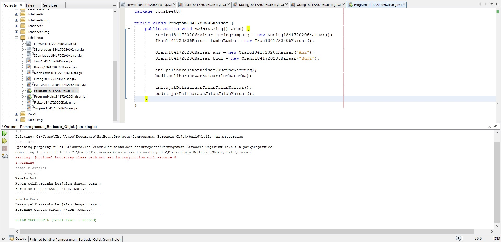
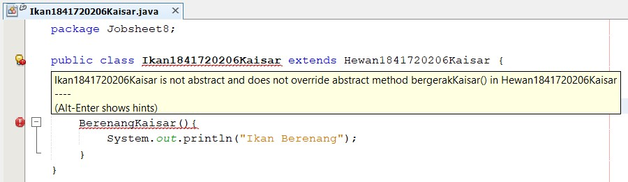
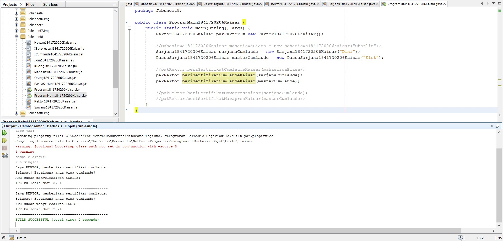
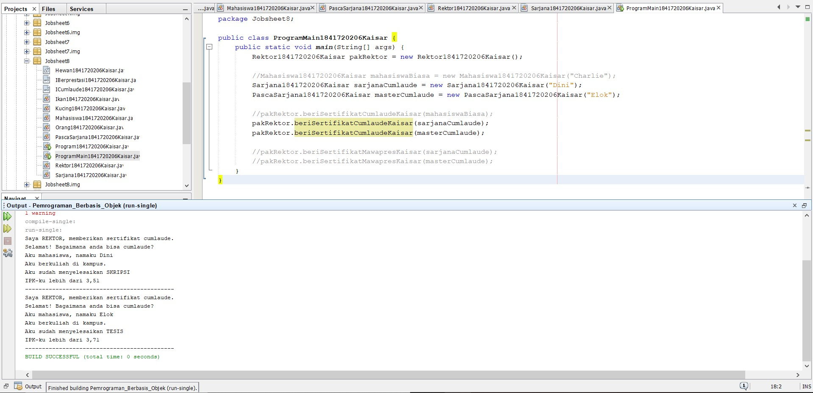
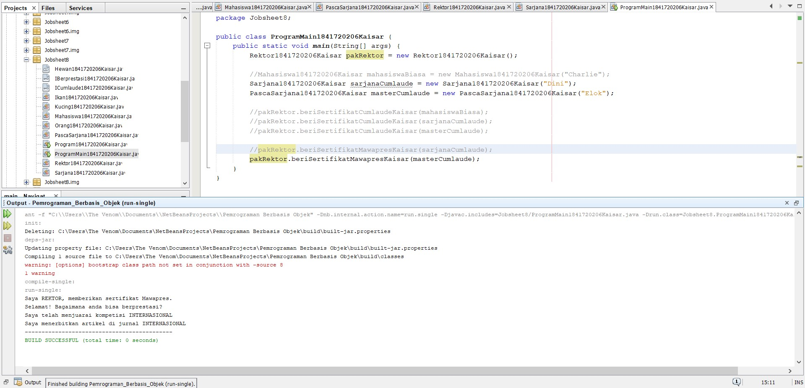
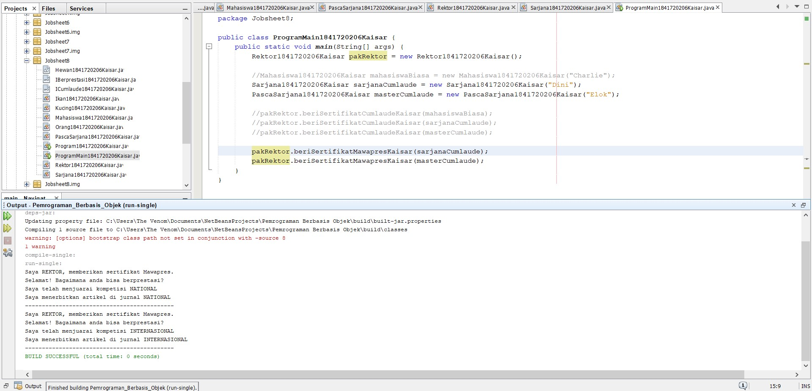

# Laporan Praktikum #9 - Abstract Class dan Interface

## Kompetensi

Setelah menyelesaikan lembar kerja ini mahasiswa diharapkan mampu: 

1. Menjelaskan maksud dan tujuan penggunaan Abstract Class; 

2. Menjelaskan maksud dan tujuan penggunaan Interface;

3. Menerapkan Abstract Class dan Interface di dalam pembuatan program. 
 

## Ringkasan Materi

 1. Abstract Class.

    Abstract Class adalah class yang tidak dapat diinstansiasi namun dapat di-extend. Abstract class baru dapat dimanfaatkan ketika ia di-extend. 

    Karakteristik: 
    
    * Dapat memiliki properties dan methods seperti class biasa. 
    
    * Selalu memiliki methods yang tidak memiliki       tubuh (hanya deklarasinya saja), disebut juga     abstract method. 
    
    * Selalu dideklarasikan dengan menggunakan kata kunci abstract class. 

    Kegunaan: 
    
    Menggambarkan sesuatu yang bersifat umum, yang hanya bisa berfungsi setelah ia dideskripsikan ke dalam bentuk yang lebih spesifik. 
 
 

2. Interface.
  
   Interface adalah struktur data yang hanya berisi abstract methods. Tidak ada apa-apa selain method abstract pada interface, termasuk atribut getter dan setter.  
 
   Karakteristik: 
   
   * Tidak ada apa-apa di dalamnya selain abstract methods. 
   
   * Di konvensi bahasa pemrograman Java, namanya dianjurkan untuk selalu diawali dengan huruf kapital ‘I’. 
   
   * Selalu dideklarasikan dengan menggunakan kata kunci interface. 
   
   * Diimplementasikan dengan menggunakan kata kunci implements. 

## Percobaan

### Percobaan 1 Abstract Class

Link kode program :

[Hewan1841720206Kaisar.java](../../src/9_Abstract_Class_dan_Interface/Hewan1841720206Kaisar.java)

[Ikan1841720206Kaisar.java](../../src/9_Abstract_Class_dan_Interface/Ikan1841720206Kaisar.java)

[Kucing1841720206Kaisar.java](../../src/9_Abstract_Class_dan_Interface/Kucing1841720206Kaisar.java)

[Orang1841720206Kaisar.java](../../src/9_Abstract_Class_dan_Interface/Orang1841720206Kaisar.java)

[Program1841720206Kaisar.java](../../src/9_Abstract_Class_dan_Interface/Program1841720206Kaisar.java)

### Pertanyaan Diskusi

1. Bolehkah apabila sebuah class yang meng-extend suatu abstract class tidak mengimplementasikan method abstract yang ada di class induknya? Buktikan! 
  
Jawaban :

    Suatu class yang meng-extend suatu abstract class harus mengimplementasikan menthod abstract yang ada pada class abstract tersebut, dan tidak boleh tidak mengimpelementasikanya, kalau hal tersebut dilakukan maka akan muncul peringatan error yaitu class tersebut bukan class abtract dan tidak meng-override abstract method yang ada pada class abtract seperti dibawah ini:

### Percobaan 2 Interface

Link kode program :

[ICumlaude1841720206Kaisar.java](../../src/9_Abstract_Class_dan_Interface/ICumlaude1841720206Kaisar.java)

[Mahasiswa1841720206Kaisar.java](../../src/9_Abstract_Class_dan_Interface/Mahasiswa1841720206Kaisar.java)

[Sarjana1841720206Kaisar.java](../../src/9_Abstract_Class_dan_Interface/Sarjana1841720206Kaisar.java)

[PascaSarjana1841720206Kaisar.java](../../src/9_Abstract_Class_dan_Interface/PascaSarjana1841720206Kaisar.java)

[Rektor1841720206Kaisar.java](../../src/9_Abstract_Class_dan_Interface/Rektor1841720206Kaisar.java)

[ProgramMain1841720206Kaisar.java](../../src/9_Abstract_Class_dan_Interface/Program1841720206Kaisar.java)

### Pertanyaan Diskusi

1. Mengapa pada langkah nomor 9 terjadi error? Jelaskan!

Jawaban :

    Karena pada class Mahasiswa belum mengimplementasi interface ICumlaude

2. Dapatkah method kuliahDiKampus() dipanggil dari objek sarjanaCumlaude di class Program? Mengapa demikian?

Jawaban :

    Bisa, karena class Sarjana merupakan turunan dari class Mahasiswa

3. Dapatkah method kuliahDiKampus() dipanggil dari parameter mahasiswa di method beriSertifikatCumlaude() pada class Rektor? Mengapa demikian?

Jawaban :

    Tidak bisa, karena class Rektor bukan turunan dari class Mahasiswa karena itu class Rektor tidak dapat mengakses method pada class Mahasiswa

4. Modifikasilah method beriSertifikatCumlaude() pada class Rektor agar hasil eksekusi class Program menjadi seperti berikut ini: 

Jawaban :

    Hasil modifikasi sesuai perintah pada pertanyaan no 4

### Percobaan 3 Multiple Interfaces Implementation 

Link kode program :

[ICumlaude1841720206Kaisar.java](../../src/9_Abstract_Class_dan_Interface/ICumlaude1841720206Kaisar.java)

[IBerprestasi1841720206Kaisar.java](../../src/9_Abstract_Class_dan_Interface/IBerprestasi1841720206Kaisar.java)

[Mahasiswa1841720206Kaisar.java](../../src/9_Abstract_Class_dan_Interface/Mahasiswa1841720206Kaisar.java)

[Sarjana1841720206Kaisar.java](../../src/9_Abstract_Class_dan_Interface/Sarjana1841720206Kaisar.java)

[PascaSarjana1841720206Kaisar.java](../../src/9_Abstract_Class_dan_Interface/PascaSarjana1841720206Kaisar.java)

[Rektor1841720206Kaisar.java](../../src/9_Abstract_Class_dan_Interface/Rektor1841720206Kaisar.java)

[ProgramMain1841720206Kaisar.java](../../src/9_Abstract_Class_dan_Interface/Program1841720206Kaisar.java)

### Pertanyaan diskusi

1. Pertanyaan diskusi: Apabila Sarjana Berprestasi harus menjuarai kompetisi NASIONAL dan menerbitkan artikel di jurnal NASIONAL, maka modifikasilah class-class yang terkait pada aplikasi Anda agar di class Program objek pakRektor dapat memberikan sertifikat mawapres pada objek sarjanaCumlaude.
  
Jawaban :

## Kesimpulan

Dari percobaan dan tugas diatas kita sudah mempelajari tentang Abstraction, Interface, dan Multiple Interface

## Pernyataan Diri

Saya menyatakan isi tugas, kode program, dan laporan praktikum ini dibuat oleh saya sendiri. Saya tidak melakukan plagiasi, kecurangan, menyalin/menggandakan milik orang lain.

Jika saya melakukan plagiasi, kecurangan, atau melanggar hak kekayaan intelektual, saya siap untuk mendapat sanksi atau hukuman sesuai peraturan perundang-undangan yang berlaku.

Ttd,

***(Kaisar Wahyu Arya)***